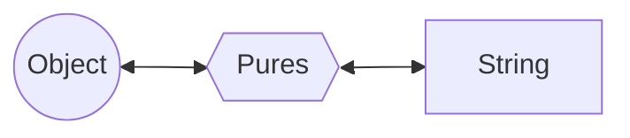

# Seriall

**Seriall** is a simple serialization library.



| Object           | Pures                                                                | String (JSON Format)                                               | Type       |
| ---------------- | -------------------------------------------------------------------- | ------------------------------------------------------------------ | ---------- |
| `true`           | `[true]`                                                             | `[true]`                                                           | Raw        |
| `16n`            | `[ { T: 3, V: "16" } ]`                                              | `[{"T":3,"V":"16"}]`                                               | BigInt     |
| `[80, 'http']`   | `[ 80, "http", [0, 1] ]`                                             | `[80,"http",[0,1]]`                                                | Array      |
| `Math`           | `[ { T: 7, K: "Math" } ]`                                            | `[{"T":7,"K":"Math"}]`                                             | RefValue   |
| `new Set()`      | `[ [], { T: 8, N: "Set", V: 0 } ]`                                   | `[[],{"T":8,"N":"Set","V":0}]`                                     | RefAdapter |
| `{name:'Steve'}` | `[{ T:7, K:"Object" }, "Steve", { T:6, C:0, P: [["name", 1, {}]] }]` | `[{"T":7,"K":"Object"},"Steve",{"T":6,"C":0,"P":[["name",1,{}]]}]` | Object     |

-   **Object** - It can be any value, but for some special type of values, you may need to specify some extra information to make it work.
-   **Pures** - It can be directly converted to JSON string, then converted back and remain unchanged.
-   **String** - A string in JSON format.

## Usage

### Serialize

Stringify an object

```ts
seriall.stringify<T>(obj: T, options: SeriallOptions = {}): string;
```

### Deserialize

Parse a string and get the object:

```ts
seriall.parse<T>(str: string, options: SeriallOptions = {}): T;
```

## Examples

### Simple value

### Instance of native Class

### Instance of custom Class

```ts
class Sheep {
	private name?: string;
	public constructor(name?: string) {
		this.name = name;
	}
	public setName(name: string) {
		this.name = name;
	}
	public getName(): string | undefined {
		return this.name;
	}
}

const opt: SeriallOptions = { values: { Sheep } };

// Origin object
const sheep = new Sheep();

const json = seriall.stringify(sheep, opt);

// Cloned object
const dolly = seriall.parse<Sheep>(json, opt);

assert(sheep instanceof Sheep);
assert(dolly instanceof Sheep);
assert(sheep !== dolly);
assert(sheep.constructor === dolly.constructor);

dolly.setName('Dolly');
assert(dolly.getName() === 'Dolly');
```

## Builtin adapters

Some types like `Date`, `Int8Array` have their internal properties, they can't be simply described like regular object (for example: `{name: 'Steve'}`). So I have written adapters for them. Those adapters for native types in JavaScript are "Builtin Adapters".

### Builtin Adapters

These are supported builtin adapters.

-   `Number` `String` `Boolean`
-   `Map` `Set`
-   `Date` `RegExp` `URL` `URLPattern`
-   `ArrayBuffer` `DataView`
-   `Uint8Array` `Uint8ClampedArray` `Int8Array` `Uint16Array` `Int16Array` `Uint32Array` `Int32Array` `Float16Array` `Float32Array` `Float64Array` `BigUint64Array` `BigInt64Array`

These are not supported yet.

-   `Iterator`
-   `URLSearchParams`
-   `Event`

These types are unserializable and won't be supported.

-   `WeakRef` `WeakMap` `WeakSet`
-   `Blob` `File`
-   `Worker` `SharedArrayBuffer`
-   `Iterator` `Proxy` `Promise` `WebSocket`
-   `Error` `AggregateError` `EvalError` `RangeError` `ReferenceError` `SyntaxError` `TypeError` `URIError`
