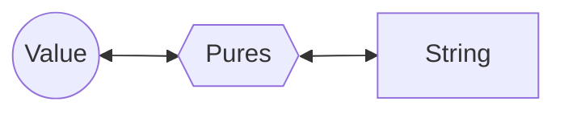

# Seriall

**Seriall** is a simple serialization library.



| Value               | Pures                                                    | String (JSON Format)                                               |
| ------------------- | -------------------------------------------------------- | ------------------------------------------------------------------ |
| `12138`             | `[12138]`                                                | `[12138]`                                                          |
| `true`              | `[true]`                                                 | `[true]`                                                           |
| `16n`               | `[{T:3,V:"16"}]`                                         | `[{"T":3,"V":"16"}]`                                               |
| `[80, 'http']`      | `[[1,2],80,"http"]`                                      | `[[1,2],80,"http"]`                                                |
| `Math`              | `[{T:7,K:"Math"}]`                                       | `[{"T":7,"K":"Math"}]`                                             |
| `new Set()`         | `[{T:8,N:"Set",V:1},[]]`                                 | `[{"T":8,"N":"Set","V":1},[]]`                                     |
| `{ name: 'Steve' }` | `[{T:6,C:1,P:[["name",2,{}]]},{T:7,K:"Object"},"Steve"]` | `[{"T":6,"C":1,"P":[["name",2,{}]]},{"T":7,"K":"Object"},"Steve"]` |

- **Value** - It can be any value, but for some special type of values, you may need to specify some extra information to make it work.
- **Pures** - It can be directly converted to JSON string, then converted back and remain unchanged.
- **String** - A string in JSON format.

## Features

- **Supports built-in types** (e.g., `Map`, `Date`, `ArrayBuffer`, `Uint8Array`)
- **Supports circular references**
- **Serializable custom class instances**
- **Deep cloning capability**
- **Lightweight & dependency-free**

## Installation

### deno

```bash
deno add jsr:@leawind/seriall
```

### npm

```bash
npx jsr add @leawind/seriall
```

### yarn

```bash
yarn dlx jsr add @leawind/seriall
```

### pnpm

```bash
pnpm dlx jsr add @leawind/seriall
```

### bun

```bash
bunx jsr add @leawind/seriall
```

## Usage

Import **seriall**

```bash
import * as seriall from "@leawind/seriall";
```

### Serialize

Stringify an object

```ts
seriall.stringify<T>(obj: T, options: SeriallOptions = {}): string;
```

### Deserialize

Parse a string and get the object:

```ts
seriall.parse<T>(str: string, options: SeriallOptions = {}): T;
```

### Deep clone

Deep clone an object. This function serialize the given object and then deserialize it.

```ts
seriall.deepClone<T>(obj: T, options: SeriallOptions = {}): T;
```

## Examples

### Simple value

```ts
const alice = { name: '' };
const json = seriall.stringify(alice);
const dolly = seriall.parse<typeof alice>(json);

assert(alice.name === dolly.name);
```

### Instance of bulit-in Class

```typescript
const original = new Map<unknown, unknown>([
	['name', 'Steve'],
	['effect', new Set()],
	['pos', [-2, 64, 1.23]],
]);
// deepClone means serialize and then deserialize
const cloned = seriall.deepClone(original);

assertStrictEquals(cloned.get('name'), 'Steve');
assert(cloned.get('effect') instanceof Set);
assert((cloned.get('pos') as number[])[2] === 1.23);
```

### Instance of custom Class

```ts
class Sheep {
	private name?: string;
	public constructor(name?: string) {
		this.name = name;
	}
	public setName(name: string) {
		this.name = name;
	}
	public getName(): string | undefined {
		return this.name;
	}
}

const options: SeriallOptions = { values: { Sheep } };

const sheep = new Sheep();
const dolly = seriall.deepClone(sheep, options);

assert(sheep instanceof Sheep);
assert(dolly instanceof Sheep);
assert(sheep !== dolly);
assert(sheep.constructor === dolly.constructor);

dolly.setName('Dolly');
assert(dolly.getName() === 'Dolly');
```

## Builtin adapters

You may have noticed this in previous example about built-in class instance. Some types like `Map`, `Date`, `Int8Array` have their internal properties, they can't be simply described like regular object (for example: `{name: 'Steve'}`). So I have made some adapters for them.

These are supported builtin adapters.

- `Number` `String` `Boolean`
- `Map` `Set`
- `Date` `RegExp` `URL` `URLSearchParams` `URLPattern`
- `ArrayBuffer` `DataView`
- `Uint8Array` `Uint8ClampedArray` `Int8Array` `Uint16Array` `Int16Array` `Uint32Array` `Int32Array` `Float16Array` `Float32Array` `Float64Array` `BigUint64Array` `BigInt64Array`
- `ImageData` `ByteLengthQueuingStrategy` `Headers`

The implementation of those built-in adapters are at `src/seriall/builtin/adapters.ts`. You can also implement adapter for your custom Class.

## Limitations

- **Added properties on special instances**\
  Manually added properties to arrays or any class instances with adapters (e.g., `Map`, `Date`, `ArrayBuffer`) will be **silently dropped**.\
  Example:

  ```ts
  const arr = [1, 2];
  arr.customProp = 'value'; // ❌ Won't survive serialization
  ```

- **No field filtering**\
  All string-keyed own properties are serialized by default. Custom selection of serializable fields is not supported.

- **Symbol-keyed properties**\
  Properties with `Symbol` keys will be **ignored** during serialization.

- **JavaScript/TypeScript only**\
  Currently lacks cross-language support. Serialized data can only be deserialized in JavaScript/TypeScript environments.
